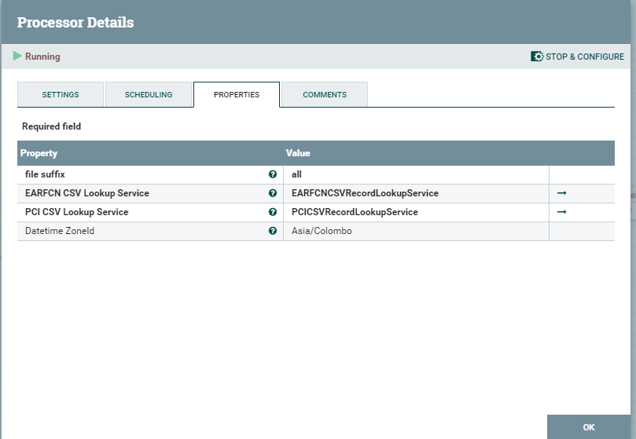
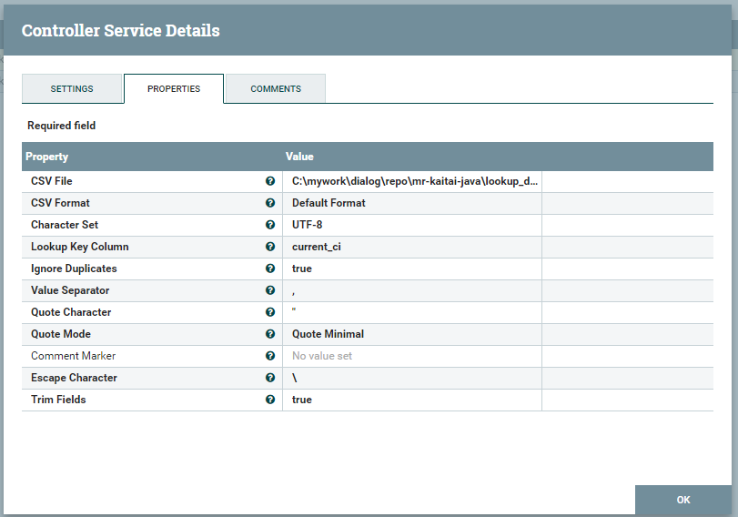
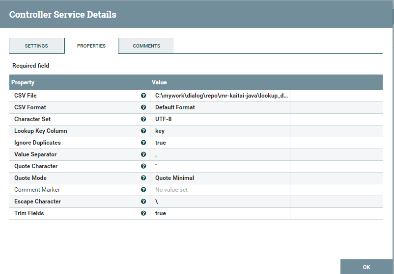

## Dialog MR Binary file conversion

### 1. Architecture

Binary file decoding and event merging primarily performed on prem server with the help of Apache NiFi.

The following two diagrams show the basic flow of both Huawei and Ericsson files.

- Huawei conversion flow
  

- Ericsson conversion flow
  

> Note: TODO: We have to include the Kafka stream integration to the above diagram.

### 2. Available Processors

1. `EricssonBinaryJSONProcessor` - Converts Ericsson binary file events to JSON line output
2. `HuaweiBinaryJSONProcessor` - Converts Huawei binary file events to JSON line output
3. `HuaweiBinaryCSVMergeProcessor` - Decodes Huawei binary file events, then lookups `earfcnmap` `nbrmap` values, finaly does the record merging and output CSV records.
4. `EricssonBinaryCSVMergeProcessor` - Decodes Ericsson binary file events, then lookups `nbrmap` values, finally does the record merging and output the CSV recirds.

### 3. Setting up Processors

#### Preparing lookup service CSV files

Both `HuaweiBinaryCSVMergeProcessor` and `EricssonBinaryCSVMergeProcessor` requires external CSV files for data lookups. These CSV files are integrated through NiFi `CSVRecordLookupService`s. In order to use these we need to preformat them with the key column.

Already preformatted files that can be used directly are available under `lookup_data/{huawei/ericsson}` folders.

This section explains on how to create or recreate these preformatted CSV files if required.

- Huawei Lookup files.

  Huawei conversion requires two lookup services with two preformatted CSV files.

  - `FW__NB-MDT/earfcnmap.csv`  - This is a single column key lookup file, hence we don't need to preformat, however it is required to change the header column in lower case. Preformatted file available in [`lookup_data/huawei/huawei_earfcnmap.csv`](../../lookup_data/huawei/huawei_earfcnmap.csv)

  - `FW__NB-MDT/nbrmap.csv` - This is multiple column key lookup file, hence we need to preformat. You can use the `t_csv.py` script available in `mr` repository (`dev` branch).
      ~~~sh
      python3 t_csv.py FW__NB-MDT/nbrmapp.csv FW__NB-MDT/nbrmapp_withkey.csv serving_cell_id,pci
      ~~~

      > Note: that you need python3 installed and also `pandas` package installed.

      Preformatted file is already available in [`lookup_data/huawei/huawei_nbrmap_withkey.csv`](../../lookup_data/huawei/huawei_nbrmap_withkey.csv)

- Ericsson Lookup files.

  Ericsson conversion requires one lookup service with preformatted CSV file.

  - `.temp.nrbmap.csv` - This is also a multiple column key lookup file, hence we need to preformat. You can use the same `t_csv.py` script available in `mr` repository (`dev` branch).

  ~~~sh
  python3 t_csv.py .temp.nrbmap.csv ericsson_nbrmap_with_key.csv enbid,earfcn,pci
  ~~~

  Preformatted file is already available in [`lookup_data/ericsson/ericsson_nbrmap_with_key.csv`](../../lookup_data/ericsson/ericsson_nbrmap_with_key.csv)

#### `HuaweiBinaryCSVMergeProcessor`

This processor requires two separate lookup services.

1. EARFCN CSV Lookup Service

   Create new `CSVRecordLookupService` with the following settings.
   Set the CSV file path to `huawei_earfcnmap.csv` file. You can find this file in `lookup_data/huawei` folder in project root

   

2. PCI CSV Lookup Service

   Create new `CSVRecordLookupService` with the following settings.
   Set the CSV file path to `huawei_nbrmap_withkey.csv` file. You can find this file in `lookup_data/huawei` folder in project root

   

#### `EricssonBinaryCSVMergeProcessor`

This processor requires one lookup service.

1. NBRMAP CSV Lookup Service

   As in Huawei lookup service create the `CSVRecordLookupService` with the below settings.

   - `CSV File` - `ericsson_nbrmap_with_key.csv`
   - `Lookup Key Column` - `key`

### Huawei NiFi Conversion Flow

> TODO: Add flow diagram

### Ericsson NiFi Conversion Flow

> TODO: Add flow diagram